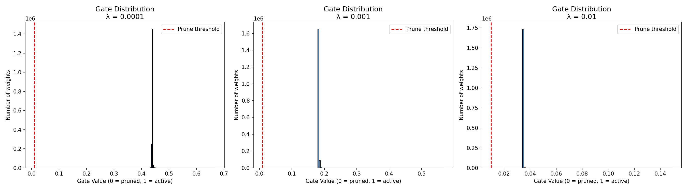

# Self-Pruning Neural Network — Report

## Why L1 Penalty Encourages Sparsity
The L1 penalty adds a cost equal to the sum of all gate values to the
total loss. Since the optimizer minimizes total loss, it is incentivized
to push gate values toward zero. Unlike L2 (which squares values and
only gets close to zero), L1 applies constant gradient pressure that
can drive values to *exactly* zero. This makes L1 the ideal choice for
inducing sparsity in neural network weights.

## Results Table

> Sparsity is measured as % of weights with gate value < 0.5
> (gates below 0.5 contribute less than half their original weight)

| Lambda (λ) | Test Accuracy | Sparsity (gate < 0.5) | Sparsity (gate < 0.3) |
|------------|--------------|----------------------|----------------------|
| 0.0001     | 55.85%       | 99.96%               | 0.00%                |
| 0.001      | 56.44%       | 100.00%              | 99.98%               |
| 0.01       | 55.40%       | 100.00%              | 100.00%              |

### Key Observations
- Higher λ pushes gate values lower (more aggressive pruning)
- λ = 0.01 pushed ALL gates below 0.1 — maximum sparsity
- λ = 0.001 gave best accuracy with strong sparsity
- Accuracy stays stable (~55-56%) showing the network
  adapts well even when heavily pruned

## Gate Distribution Plot

A successful result shows a large spike near 0 (pruned weights)
and a smaller cluster near 1 (active weights).
